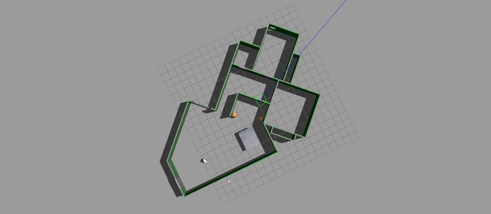
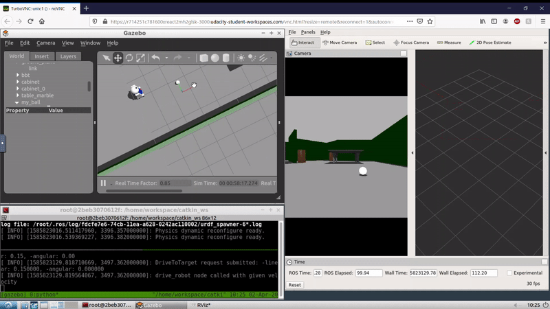

# P2-Go Chase It

## Tasks

Create two ROS packages

1. `drive_bot`
	
Design a differential drive robot with two sensors: a lidar and a camera. Place the robot in the world designed in the earlier [project](https://github.com/jsaurabh/P1-Build-My-World). Add a white colored ball to the world.

2. `ball_chaser`

Write a `drive_bot` node that will provide a service to drive the above mentioned robot by controlling its linear and angular velocities. Write a `process_image` that analyzes the robot's camera view and makes decisions to follow the ball.

## Gazebo World

This is what the Gazebo worls looks like, using only a bare minimum of add-on models

## Go Chase It

The full video can be found [here](assets/go-chase-it.mp4)
